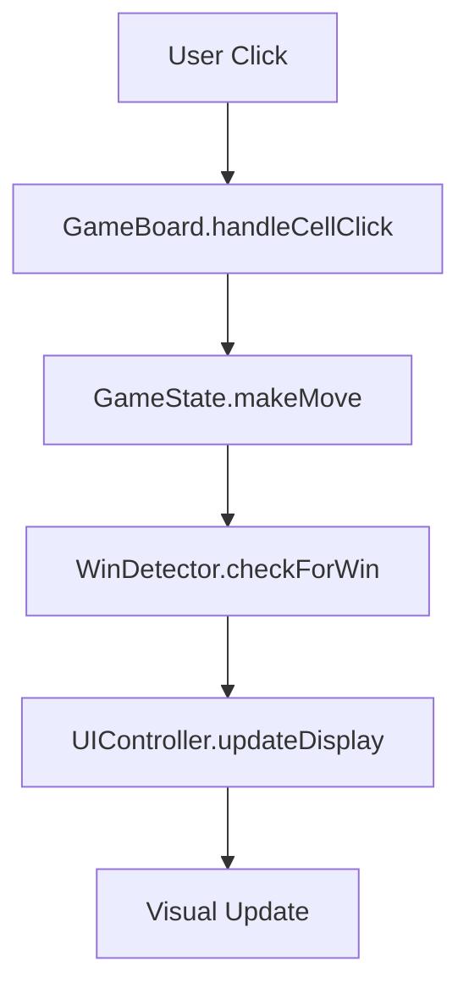

# Design Document: Tic Tac Toe Application

## Overview

The Tic Tac Toe application will be implemented as a client-side web application using vanilla HTML, CSS, and JavaScript. The design follows a modular approach with clear separation of concerns: HTML for structure, CSS for presentation, and JavaScript for game logic and interaction handling.

The application architecture centers around a game state management system that tracks the current board state, active player, and game status. The user interface will be responsive and provide immediate visual feedback for all player interactions.

## Architecture

The application follows a simple client-side architecture with three main layers:

1. **Presentation Layer (HTML/CSS)**: Defines the visual structure and styling
2. **Logic Layer (JavaScript)**: Handles game rules, state management, and user interactions
3. **Data Layer (JavaScript Objects)**: Manages game state and board representation

```
┌─────────────────┐
│   HTML/CSS      │ ← Presentation Layer
│   (UI/Styling)  │
└─────────────────┘
         │
┌─────────────────┐
│   JavaScript    │ ← Logic Layer
│   (Game Logic)  │
└─────────────────┘
         │
┌─────────────────┐
│   Game State    │ ← Data Layer
│   (Board/Status)│
└─────────────────┘
```

## Components and Interfaces

### Core Components

**GameBoard Component**
- Manages the 3x3 grid representation
- Handles cell click events
- Updates visual display of marks
- Interface: `renderBoard()`, `handleCellClick(index)`, `clearBoard()`

**GameState Component**
- Tracks current player (X or O)
- Maintains board state array
- Manages game status (playing, won, draw)
- Interface: `getCurrentPlayer()`, `makeMove(index)`, `checkWinner()`, `reset()`

**UIController Component**
- Handles DOM manipulation
- Updates status displays
- Manages user interactions
- Interface: `updateDisplay()`, `showMessage(text)`, `bindEvents()`

**WinDetector Component**
- Evaluates win conditions
- Checks for draw conditions
- Interface: `checkForWin(board)`, `checkForDraw(board)`

### Component Interactions



## Data Models

### Board State Model
```javascript
// Board represented as array of 9 elements
// null = empty, 'X' = X mark, 'O' = O mark
board: [null, null, null, null, null, null, null, null, null]

// Index mapping:
// 0 | 1 | 2
// 3 | 4 | 5  
// 6 | 7 | 8
```

### Game State Model
```javascript
gameState: {
  board: Array(9).fill(null),
  currentPlayer: 'X',
  gameStatus: 'playing', // 'playing', 'won', 'draw'
  winner: null // null, 'X', 'O'
}
```

### Win Patterns Model
```javascript
winPatterns: [
  [0, 1, 2], // Top row
  [3, 4, 5], // Middle row
  [6, 7, 8], // Bottom row
  [0, 3, 6], // Left column
  [1, 4, 7], // Middle column
  [2, 5, 8], // Right column
  [0, 4, 8], // Diagonal top-left to bottom-right
  [2, 4, 6]  // Diagonal top-right to bottom-left
]
```

## Correctness Properties

*A property is a characteristic or behavior that should hold true across all valid executions of a system—essentially, a formal statement about what the system should do. Properties serve as the bridge between human-readable specifications and machine-verifiable correctness guarantees.*

After analyzing the acceptance criteria, I've identified the following properties that can be automatically tested. I've eliminated redundant properties and combined related ones for comprehensive coverage:

### Property 1: Valid moves place marks correctly
*For any* empty cell on the game board and any current player, clicking that cell should place the current player's mark in that cell and leave all other cells unchanged.
**Validates: Requirements 1.2**

### Property 2: Invalid moves are rejected
*For any* occupied cell on the game board, clicking that cell should not change the board state or current player.
**Validates: Requirements 1.3**

### Property 3: Visual mark distinction
*For any* game board state containing both X and O marks, the rendered output should visually distinguish between X and O marks.
**Validates: Requirements 1.4**

### Property 4: Turn alternation
*For any* valid move made during active gameplay, the current player should switch to the other player after the move is completed.
**Validates: Requirements 2.2**

### Property 5: UI reflects current player
*For any* game state during active gameplay, the UI display should accurately show which player's turn it currently is.
**Validates: Requirements 2.3**

### Property 6: Finished games prevent moves
*For any* game that has ended (won or draw), attempting to make a move should not change the board state or game status.
**Validates: Requirements 2.4**

### Property 7: Current player tracking
*For any* active game state, there should always be a valid current player (either X or O).
**Validates: Requirements 2.5**

### Property 8: Win detection for all patterns
*For any* winning configuration (three marks in a row horizontally, vertically, or diagonally), the game should correctly identify the winner and end the game.
**Validates: Requirements 3.1, 3.2**

### Property 9: Winner display accuracy
*For any* game that ends with a winner, the UI should display the correct winning player.
**Validates: Requirements 3.4**

### Property 10: Reset clears board completely
*For any* game state, clicking the reset button should clear all marks from the board and return it to the initial empty state.
**Validates: Requirements 4.2**

### Property 11: Reset restores initial state
*For any* game state, clicking the reset button should restore the game to its initial state with X as the current player and game status as playing.
**Validates: Requirements 4.3**

### Property 12: Reset clears UI messages
*For any* game state with displayed win or draw messages, clicking the reset button should clear all status messages from the UI.
**Validates: Requirements 4.4**

### Property 13: Post-reset gameplay
*For any* game state, after clicking the reset button, the game should immediately allow valid moves to be made.
**Validates: Requirements 4.5**

## Error Handling

The application will handle the following error conditions gracefully:

**Invalid Move Attempts**
- Clicking occupied cells: Silently ignore the click, maintain current state
- Moves after game end: Prevent the move, display appropriate message
- Invalid cell indices: Validate indices before processing

**UI Error States**
- Missing DOM elements: Check for element existence before manipulation
- Event binding failures: Use defensive programming for event listeners
- Display update failures: Gracefully handle DOM update errors

**State Consistency**
- Invalid game states: Validate state transitions before applying
- Corrupted board states: Reset to initial state if corruption detected
- Player state errors: Default to X if current player becomes invalid

## Testing Strategy

The testing approach will use a dual strategy combining unit tests for specific scenarios and property-based tests for comprehensive coverage:

**Unit Testing**
- Test specific game scenarios and edge cases
- Verify initial game state setup
- Test individual component functions
- Validate error handling paths
- Test UI integration points

**Property-Based Testing**
- Use a JavaScript property testing library (such as fast-check)
- Configure each property test to run minimum 100 iterations
- Generate random game states and moves for comprehensive coverage
- Each property test will reference its corresponding design property
- Tag format: **Feature: tic-tac-toe, Property {number}: {property_text}**

**Test Coverage Areas**
- Game logic validation (win detection, turn management)
- UI state synchronization
- Error condition handling
- State transitions and consistency
- Reset functionality
- Board manipulation operations

The combination of unit tests and property tests ensures both concrete bug detection and verification of universal correctness properties across all possible game states.